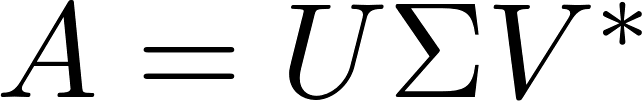
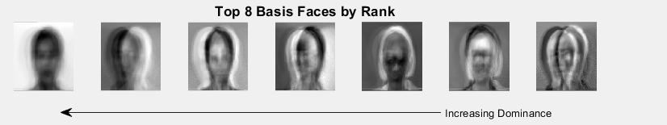

**Facial Reconstruction in MATLAB
Using Singular Value Decomposition (SVD)**
========================================

by J. Barhydt1

*University of Washington, Seattle, WA, 98195*

> **Overview:**

> **Singular Value Decomposition (SVD) is a useful computational tool
> for reducing the dimensionality of an overdetermined system. It has
> myriad applications from facial recognition software, to
> noise-reduction of scientific data, to quantum information, and is
> even used by Netflix to filter and determine user content. In this
> paper, the method is used to deconstruct a database of faces, allowing
> low-rank approximation to reconstruct the images.**

1- This report uses Extended Yale Faces B Database: http://vision.ucsd.edu/~iskwak/ExtYaleDatabase/ExtYaleB.html

- [I. Introduction and Overview](#introduction-and-overview)
- [II. Theoretical Background](#theoretical-background)
- [III. Algorithm Implementation and Development](#algorithm-implementation-and-development)
- [IV. Computational Results](#computational-results)

# Sec. I. \| ** Introduction and Overview**
========================================

A Yale database of faces was used to compile images of many individual's
faces. There are two datasets overall: one set is cropped so the faces
are well-aligned, while the other is uncropped. Once the SVD is
performed, a number of computations and analyses are performed. First, a
spectrum of singular values used to determine the weight of the
underlying basis faces that construct the 'face space', which represents
underlying structure of all faces. A comparison is then made of the
ability to reconstruct a face, as well as the eigenfaces themselves. To
observe the evolution of low-rank approximations, the matrix is
reconstructed piecemeal. Finally, a comparison is made between the
cropped and uncropped images, and various faces are mapped onto the
'face space' to allow for reconstruction.

Sec. II. \| Theoretical Background
==================================

The SVD produces two orthogonal, unitary basis sets which represent the
deconstruction of a matrix A, given by the SVD equation
. 
In our case A is given by
vectorizing all images, so each column is a new image, thus A contains
all images. The basis vectors can be understood by their construction
and how they affect the matrix A. For instance,
 being acted upon by
 can be shown as a new
**.** Since the covariance
matrix, up to a scalar normalizing constant, of
 is given by
, we have
. Where
**.** Since
 and
 are both unitary operators,
they carry the property that their inverse and transpose are equal.
Putting everything together yields

 .

Therefore,  is an operator that
diagonalizes , because

 is a diagonal matrix.
This is important given an understanding of
. In figure 1, a representation of this
product is shown. As each column of a is multiplied by itself and all
combinations of columns, this product represents a covariance matrix,
where the diagonal values represent the internal variance of each photo,
while the off-diagonals represent how each photo is *different*. By
diagonalizing , we build a matrix with orthogonal
vectors, with no covariance between them, and the vectors in
 become an orthonormal basis
for .

By the same logic, **U** diagonalizes **A**. This is where the primary
utility of the SVD process comes into play, as **U** forms an
orthonormal basis, comprised of eigenfaces organized in order of
decreasing prominence, shown as figure 2. These eigenfaces make up the
primary structure underlying all the faces, and is valuable in the
reconstruction. The matrix
 thusly gives respective
weights to each of the underlying eigenfaces, in descending order. By
construction, a rank k approximation of A can then be built by
truncating these three matrices and summing over the remaining vector
components, shown by the following equation
. Furthermore, the L2 norm
of of the difference between A and
 equals the squared singular values,
added in quadrature. Therefore, it follows that the SVD is a
least-squares method of reconstruction and will yield the best rank k
approximation possible.

> 

> **Figure 1. Simplified representation
> of the covariance matrix
> **

> 

> **Figure 2. Columns 
> comprising of the eigenface matrix U**

Sec. III. \| Algorithm Implementation and Development
=====================================================

In order to work easily with each photo, a scalar multiplier was used to
change the image size while maintaining aspect ratio, primarily for
testing, so the program could run quickly on a laptop. Each photo was
imported and vectorized, to construct the columns of the A matrix, such
that each column represented an individual photograph. Since the face
space was technically full rank, a truncation tolerance value was used
as a cutoff so that a reconstruction could be made without using the
full SVD matrices. This tolerance was checked against the values of the
s\_norm, which is the matrix containing the singular values, normalized
to represent the weight of each value. A log plot was used for the s
matrix, since the values span several orders of magnitude. To get an
idea of how well a reconstruction will perform, the normalized singular
values were sequentially summed and plotted. The facial reconstruction
was performed using two methods: Firstly, a partial sum of u\*s\*v
recreated the matrix A, up to a k rank approximation using k columns of
the SVD matrices. Secondly, a vectorized image was projected onto U,
giving a unique 'fingerprint' for the image consisting of the linear
combination of basis vectors needed to rebuild the image. Thus, summing
over the multiplication of each value of the 'fingerprint' by its
corresponding eigenface, up to the truncation level constituted the
iterative reconstruction.

Sec. IV. \| Computational Results
=================================

There were five parts to the computational results, shown below.

SVD Spectrum - Cropped/Uncropped
--------------------------------

Plotting the diagonals of the
 matrix gave a spectrum of
the 'strength' of each basis mode. This spectrum is shown for both the
cropped and uncropped sets on the top of figures 3 and 4, respectively.
Additionally, the truncation cutoff line is shown for both sets. The
uncropped set shows its main weakness right there. The uncropped set
doesn't reach its truncation point until nearly the entire set has been
used.

> 

> **Figure 3. SVD Spectrum for Cropped Photos
> (log plot above with truncation, normalized spectrum below)**

> 

> **Figure 4. SVD Spectrum for Uncropped Photos
> (log plot above with truncation, normalized spectrum below)**

Furthermore, a comparison is shown between the most dominant singular
values, properly normalized to show relative weighted strengths. One of
the first surprises in the data was a strength of 30% for the
fundamental eigenface mode in the uncropped set. It seems to suggest
that the uncropped photo can be recreated 'better' with just a single
mode. After more consideration, this can be interpreted by the much
larger proportion of 'white space' in the uncropped photos. Since there
was a large, plain background behind each subject, a large portion of
the photo was blank. As such, it would be trivial to recreate this flat,
blank backdrop.

Basis Faces (eigenfaces) - Cropped/Uncropped
--------------------------------------------

A clear distinction between the two sets can be made by considering the
basis modes themselves. In Figure 5 below, the most prominent of these
eigenfaces are shown. The cropped set 'looks like' a set of faces,
ghostly as they may be, whereas the uncropped set looks a bit more like
modern art; it is difficult to make out any structure as the faces seem
very blurry. Also, in the cropped set, it is interesting how the most
dominant face appears quite androgynous.

>  

>  

> **Figure 5. Highest ranked basis faces for each (un/cropped) dataset**

Reconstruction Percent - Cropped/Uncropped
------------------------------------------

Further consideration of the performance of these sets can be obtained
by summing over the normalized weights of the singular value spectra.
Figure 5 \-- on the left \-- shows the percent of reconstruction after
so many modes for the cropped set. It can be once again seen that the
uncropped set starts off better, at nearly 30% compared to 12%, however
the cropped set has a much sharper increase and after an eighth of the
modes are considered beats the uncropped set by almost 15%.

> 

> **Figure 6. Percent approximation
> vs. rank - Cropped**

>  

> **Figure 7. Percent approximation
> vs. rank - Uncropped**

Reconstruction as a Function of Rank
------------------------------------

> 

> **Figure 8. Reconstruction Results for a Range of Rank K
> Approximations**

By performing the partial sum, discussed in Section II, a range of
low-rank approximations show the evolution of reconstructing a face,
shown above in Figure 8. Rank 1 \-- the fundamental eigenface \-- merely
captures the tone, however the face becomes quite recognizable on the
order of tens of eigenfaces. On the bottom center, the 0.1% truncated
mode reconstruction shows a very good match to the full 2414 rank, even
capturing much of the nuances in fine structure like pock-marks and
creases.

Truncated Reconstruction and 'Fingerprints'
-------------------------------------------

Projecting any vectorized image onto the basis space yields a weighting
of strength for all of the orthogonal eigenfaces. In Figure 9, three
such images, projections, and reconstructions are shown. Each projection
creates a unique 'fingerprint' of the vectors that make up any face \--
or any image for that matter \-- since the basis is complete, it could
reconstruct any image given enough basis vectors to use. Comparing an
original photo to a noisy one, top and middle respectively, shows that
this method is very robust for noisy images. In this set, the noise
level was set to 40% of peak values. As such, you can see that the noisy
image is quite difficult to make out. Regardless, the algorithm
reconstructs the image just fine, losing very little detail. On the
other hand, using a photo that has not been very carefully prepared is
much more difficult to recreate, and the bottom image shows the system's
difficulty in trying to 'build' a smiling mouth and slightly angled
face. The reconstruction still has some of the broad structure of the
original face, although it is far from a good rebuild, especially in
comparison to how well the noisy image performed. Note that the
fingerprints are shown without axis values; this was more of a visual
preference, though the domain spans 0 to truncation index, and the range
varies widely photo-to-photo, often between +/- 10 to 100.

> 

> **Figure 9. Original Image , Fingerprint, and Reconstruction of a
> Raw Image, a Noisy Image, and a New Image (top, middle, bottom
> respectively)**

Sec. V. \| Summary and Conclusions
==================================

SVD allows for great reduction in dimensionality, as demonstrated by the
low-rank facial reconstructions. Furthermore, the method performs
incredibly well with regard to noise. However, performing a 'clean'
reconstruction is not always guaranteed, and photos that are outside of
the set, or not cropped properly are much more difficult to analyze.
Adequately reconstructing a face from the uncropped set requires many
more of the basis faces. This is not too surprising, as the uncropped
photos have a wide range of poses, facial expressions, etc that have to
be captured. Coincidentally, it took a similar quantity of modes to
rebuild a photo from either set: 161 out of 2414 from the cropped set
compared to 147 out of 165 from the uncropped set. Clearly the cropped
set is able to construct lower-rank reconstructions. As such, it is
shown that the process of cropping is essential to any program involving
facial recognition or digital reconstruction, and the decomposition
struggles to recreate images/data that aren't within the set and/or
properly cropped.

APPENDIX A (MATLAB Functions Used / Description With Example)
=============================================================

dir( \'CroppedYale/\*/\*.pgm\' );

-   collects information about a file directory, including file/folder
    name. Date and image size is included, though not used in this
    code.

figure(4)

-   displays a window for attaching plots, graphs, images, etc.

im2double( imresize( image, \[im\_height im\_width\]));

-   grabs an image (which must be named/located) and resizes it, then
    turns it into matrix form

imshow( mat2gray( reshape( image(:,i),\[im\_height im\_width\])))

-   grabs an image that has been vectorized, resizes it and displays it
    as a grayscale image

legend(cutoff,\[\'Truncation Cutoff at %\',num2str(100\*tol)\])

-   shows legend on plot, using previously-defined variable as a string
    input

length( files )

-   returns the length of an object, such as files, which used the dir()
    function above

plot(ax1,1:data\_size,sing\_values(trunc)\*ones(data\_size,1));

-   standard plot function, with subplot ax1 specified, creating an
    x-axis based on integers from 1 to end

0.4\*randn(im\_height\*im\_width,1)

-   creates a random matrix, the size of an image, in this case with 40%
    the peak matrix value

reshape(sprintf(\'%5.0f%%\',0:10:100),6,\[\]).\';

-   renames the y tick labels, to display a percentage

semilogy(ax1, sing\_values, \'r.\'), xlim(\[0 data\_size\])

-   log plot of singular values on the ax1 subplot, restricting the x
    axis to end at the end of the data

set(gca,\'yticklabel\',labels)

-   gca stands for 'get current axis' and here that axis is set to
    change the y-axis tickmarks

subplot(2,1,1);

-   plots multiple objects onto a figure in an n by m grid, following
    subplot(n,m,i) where i is the ith object

sum(sing\_values);

-   perform a standard summation of values in a vector of singular
    values, used for normalization constant

\[u,s,v\] = svd(A,\'econ\');

-   the magic sauce. this is the reduced SVD, with sigma as matrix s

title(ax(4),\'Top 8 Basis Faces by Rank\',\'FontSize\',13)

-   sets a title and font size to the specified subplot

xlabel(\[\'Number of Basis Face Vectors Used (out of
\',num2str(data\_size),\')\'\])

-   adds a label to the x-axis, here using a variable to string function
    as before

ylabel(ax1, {\'\$log\[s\_{jj}\]\$\'},\'Interpreter\',\'latex\')

-   same as above, with the y-axis, however the latex interpreter is
    used to convert to symbols from formatting

zeros(im\_height\*im\_width,3);

-   builds a matrix of zeros, in this case the length of a vectorized
    image and width 3 for each image in figure 8

APPENDIX B (MATLAB Code)
========================

\% SVD Basis Faces: Spectrum Analysis, Projection, and Reconstruction

\% Johnathon R Barhydt

\%

\% Yale Face Files Located at:

\% http://vision.ucsd.edu/~iskwak/ExtYaleDatabase/ExtYaleB.html

\% 

clear all, close all, clc

\% photo directory name/location:

\% uncomment to change between cropped/uncropped sample set.

files = dir( \'CroppedYale/\*/\*.pgm\' );

\%files = dir( \'yalefaces/subject\*.\*\' );

\% image size: change multiplier to maintain aspect ratio.

\% 0.25 is good for speed.

multiplier = 0.25;

im\_height = 192\*multiplier;

im\_width = 168\*multiplier;

\% grayscale photo not in set to reconstruct. \--you can use your own
7:8 grayscale photo here

photo = im2double( imresize( imread(\'burke.jpg\'), \[im\_height
im\_width\]));

\% reconstruction mode truncation tolerance.

tol = 1e-3;

\% load face database.

A = zeros( im\_height\*im\_width, length( files ));

for i = 1:length( files )

image = imread( strcat( files(i).folder,\'\\\',files(i).name) );

A\_matrix = im2double( imresize( image, \[im\_height im\_width\]));

A(:,i) = A\_matrix(:);

end

\%% perform the SVD (computationally expensive).

\[u,s,v\] = svd(A,\'econ\');

\%% collect singular values, normalize, determine truncation.

sing\_values = diag(s);

s\_norm = sing\_values/sum(sing\_values);

data\_size = length(s\_norm);

\[\~,trunc\] = min(abs(s\_norm-tol\*ones(data\_size,1)));

\% SVD spectrum plot (raw logarithmic and normalized).

figure(1)

ax1 = subplot(2,1,1);

semilogy(ax1, sing\_values, \'r.\'), xlim(\[0 data\_size\])

hold on

cutoff = plot(ax1,1:data\_size,sing\_values(trunc)\*ones(data\_size,1));

hold off

title(ax1, \'Singular Value Full Spectrum\')

legend(cutoff,\[\'Truncation Cutoff at %\',num2str(100\*tol)\])

ylabel(ax1, {\'\$log\[s\_{jj}\]\$\'},\'Interpreter\',\'latex\')

xlabel(ax1, \'index j\')

ax2 = subplot(2,1,2);

bar(ax2, s\_norm(1:50))

title(ax2, \'Dominant Singular Values - Normalized\')

dim = \[.6 0 0 .4\];

str={\'Normaliztion Constant:\';\'A = \$\\sum\_{j=1}\^{n} s\_{jj}\$\'};

annotation(\'textbox\',dim,\'String\',str,\'FitBoxToText\',\'on\',\'Interpreter\',\'latex\')

ylabel(ax2, {\'\$\\frac{1}{A} s\_{jj}\$\'},\'Interpreter\',\'latex\')

xlabel(ax2, \'index j\')

\% reconstruction percentage plot

recon\_percent = zeros(data\_size,1);

for i = 1:data\_size

recon\_percent(i) = sum(s\_norm(1:i));

end

figure(2), area(recon\_percent), xlim(\[0 data\_size\]), ylim(\[0 1\])

title(\'Reconstruction Percent\')

xlabel(\[\'Number of Basis Face Vectors Used (out of
\',num2str(data\_size),\')\'\])

labels = reshape(sprintf(\'%5.0f%%\',0:10:100),6,\[\]).\';

set(gca,\'yticklabel\',labels)

\% prominent eigenfaces (color-reversed for viewing pleasure)

figure(3)

for i = 1:7

ax(i)=subplot(1,7,i);

imshow(mat2gray( reshape( -u(:,i),\[im\_height im\_width\]) ) )

end

title(ax(4),\'Top 8 Basis Faces by Rank\',\'FontSize\',13)

annotation(\'textarrow\',\[.7 .2\],\[.1 .1\],\'String\',\'Increasing
Dominance\')

\%% facial reconstruction using k modes (computationally costly).

\% note: reconstructs ALL of the faces, displaying only chosen
original\_face.

original\_face = 149; % pick a face from the photo directory

figure(4)

k = \[1 5 10 20 30 50 100 trunc data\_size\];

for j=1:9

reface = u(:,1:k(j))\*s(1:k(j),1:k(j))\*v(:,1:k(j)).\';

ax(j) = subplot(3,3,j);

imshow( reshape( reface(:,original\_face),\[im\_height im\_width\]))

str = \[\'Rank: \' num2str(k(j))\];

xlabel(str)

end

title(ax(2),\'Facial Reconstruction by Rank\',\'FontSize\',13)

\%% randomly selects single face to reconstruct

\% adds noisy version along with photo not in set.

selector = randi(\[1,data\_size\]);

image = zeros(im\_height\*im\_width,3);

image(:,1) = A(:,selector);

image(:,2) = A(:,selector)+ 0.4\*randn(im\_height\*im\_width,1); %noisy
version

image(:,3) = reshape( photo, \[im\_height\*im\_width,1\]);

\% basis projection coefficients

b = zeros(data\_size, 3);

b(:,1)=image(:,1)\'\*u;

b(:,2)=image(:,2)\'\*u;

b(:,3)=image(:,3)\'\*u;

\% reconstruct X iteratively from basis coeffs up to truncation

X = zeros(im\_height\*im\_width,3);

for i = 1:3

for k = 1:trunc

X(:,i) = X(:,i)+b(k,i)\*u(:,k);

end

end

\% show originals, spectrum \'fingerprint\', and reconstruction

figure(5)

for i = 1:3

subplot(3,3,3\*i-2)

imshow( mat2gray( reshape( image(:,i),\[im\_height im\_width\])))

subplot(3,3,3\*i-1)

bar(b(1:trunc, i)), ylim(\[-15 15\])

set(gca,\'yticklabel\',\[\],\'xticklabel\',\[\])

subplot(3,3,3\*i)

imshow( mat2gray( reshape( X(:,i),\[im\_height im\_width\])))

end

1: This report uses Extended Yale Faces B Database http://vision.ucsd.edu/~iskwak/ExtYaleDatabase/ExtYaleB.html
